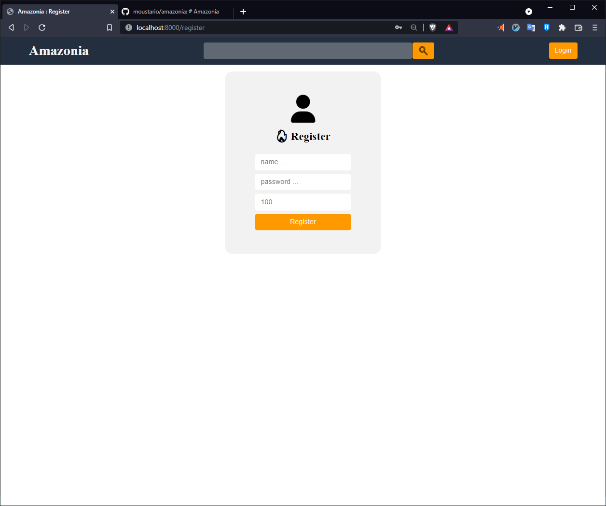

# Amazonia

A fiver like web-app base on PHP, HTML/CSS and javascript. No library or framework where used except [Font Awesome](https://fontawesome.com/).

*by mourstario*

This is a small class project for the web app cours at Plzen zcu.

## To run 

> php -S localhost:8000

At the root of the project.

You also need a data base intiliazed with the db.sql script.

## The aim of the app

The aim of this project is to create a small marketplace similar to Fiver in which user can offer services.
This project is not meant to be a commercial product or a POC of a commercial product. 

## Type of users

There are three types of users of the app:

- Unregistered users : Nothing required, can see gig but not purchase anything nor propose serivces.
- Registered user : Have an account on the website, can purchase and provide services on the website.
- Admin user : Have an account and it bee admin, can take the control of other user to managed the website.

## The Home page

On the home page is as follow, depending on wether the user is registered or not it change.

Here you can see all the available gigs on the website.
If you are connected you can also puchase other user gigs.

## The Login page

This page is access by pressing the following button.

And the Login page looks likt this : 

Here an unregistered user can log in his account to gain acces to the other functionalities of the website.

## The Register page

If user has no account he can make one by pressing this link on the login page.

Here after filling the form a new account will be created.

## The Profile page

This is the biggest page on the website and is only available if connected.

It containes multiples categories.

You can change you personal details.But you will need to disconnect and log back in for you session details to change.

Here you can offer new services and see the gigs you bought.

Here you can see the gigs you sold and the acces to the admin page if you are an admin.

## The Admin page

This is onlyu available to the user flagged as admin in the Data Base.

This page allows you to take control of other user in order to manage the app and database.
